# 华为SD-WAN高层主打胶片v2

- Source: `华为SD-WAN高层主打胶片v2.pptx`
- Total slides: 21

## Slide 1

引领智能IP网络

华为SD-WAN高层主打胶片

广域网络营销运作部

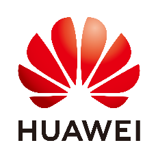

## Slide 2

- 企业互联迈入5G+SD-WAN时代
- 华为SD-WAN解决方案，打造企业上云宽管道
- 成功案例

## Slide 3

商业驱动：更多的企业在转型过程中对网络提出更高诉求

- 全球化
- 分支机构快速扩张

- 云化
- 2020年，85%企业业务上云

- 数字化
- AI，AR/VR成常态，联网终端数爆增

- 更大带宽
- 10~100M 专线  100M~10G 混合链路

- 更优体验
- IaaS/SaaS, AI, AR/VR体验优化

- 更高效率
- 加速TTM，运维自动化

更大带宽，更优体验，更高效率的企业分支互联

## Slide 4

技术驱动：5G和SD-WAN为代表的新技术正在赋能分支互联

- 5G + SD-WAN
- （L3~L7）

- 多功能融合
- （L2~L4）

- 纯路由
- （L2~L3）

- +5G, SD-WAN
- +应用识别和优化
- +Wi-Fi，LTE ,安全，VPN，语音…
- +路由，交换

- +Wi-Fi，LTE ,安全，VPN，语音…
- +路由，交换

+ 路由，交换

分支互联将原生支持5G+SD-WAN技术，从L2~L4路由转发向L3~L7应用体验保障升级

## Slide 5

商业和技术双轮驱动助推企业分支互联迈入5G SD-WAN时代

5G SD-WAN

带宽需求：>100M

5G/Fiber灵活联接

TTM：数月到数天

应用优化策略

互联体验超低时延

自动化管理和部署

数字化变革

5G已来

双轮驱动

全球化运营

5G/LTE/3G

数字化体验

SD-WAN

商业

技术

- 更优的业务体验
- 更高的管理效率

云化转型

应用体验保障

### Speaker Notes

- 出行正处于产业变革期，未来出行是建立在智能的车和聪明的路基础上的车路合作式智能交通。ICT技术将使能这一场变革。
- 智能的车，就是一个智能移动空间，无缝联接人-车-家，基于智能计算平台和各种智能终端，带给人们智能驾乘体验。
- 聪明的路，是指道路设施的数字化和智能化，包括智能交通灯，路侧雷达、摄像机，道路标识数字化等等。
- 车路合作式智能交通，是实现无人驾驶的必由之路，ICT技术将实现车路信息的实时交互与感知，使得车路主动双向互动成为标配。
- **********************************
- Slide Owner: Luo Cai （00231878), Corporate MKT
- Latest update: Jan, 2019
- Recommended target audience: all
- **********************************

## Slide 6

- 企业互联迈入5G+SD-WAN时代
- 华为SD-WAN解决方案，打造企业上云宽管道
- 成功案例

## Slide 7

华为在分支互联领域的持续探索，“厚积薄发”

5G SD-WAN

- 首款ICT融合网关发布
- 基于SDN的敏捷分支

- AR G3发布
- 多核架构，多接口

- CloudVPN发布
- 面向中小企业的分支创新

- SD-WAN发布
- 全系列CPE/uCPE/vCPE

2010

2014

2016

2017

2020

Router3.0~4.0

Router5.0

VRP

VPN

高性能

uCPE

0接触开局

网络编排

NFV

传统接口

ICT融合

LTE/3G

应用选路

Overlay

5G

华为分支互联二十年，扎扎实实的积累，“厚积” 而“薄发”

多核架构

vCPE

SDN

WOC

可视化

敏捷控制器

安全

Wi-Fi

xPON

应用识别

AI

Bonding

### Speaker Notes

- AI是一种技术，华为云致力于将AI和企业实际业务场景深度结合，提供华为云EI（Enterprise Intelligence）服务和EI智能体解决方案，用AI技术解决企业实际业务问题。
- EI ModelArts是华为云提供的一站式普惠AI开发平台。通过“极快” （图像识别训练全球最快）和 “极简”（通过创新的ExeML自动学习技术）实现0代码AI模型开发
- 华为云提供EI Advanced API的丰富接口。这些接口有两个特点，全领域覆盖（支持全域的AI能力开发，即支持视频，图片，语言和文本等）；“零门槛”，企业应用的开发人员能很简单的使用这些API接口。
- 华为云除了面向开发者提供一站式普惠AI开发平台，和面向企业应用提供EI API服务外，结合行业Know how和企业生产运营的大数据，面向工业，交通，城市等行业场景提供EI 智能体解决方案。
- 华为云是目前国内唯一的提供AI全栈全场景能力的云服务商。
- 华为云EI ModelArts，从0到1开发训练AI模型，通过“极快”和“极简”实现普惠AI。华为云EI ModelArts一站式AI开发平台，提供海量数据预处理及半自动化标注、大规模分布式训练、自动化模型生成，以及端-边-云模型按需部署能力，管理全生命周期 AI 工作流。
- 图像识别训练全球最快（By 斯坦福大学 DAWN Benchmark测试）；通过创新的ExeML（自动学习）技术，，实现0代码极简AI模型开发。
- **********************************
- Slide Owner: Gaoshijie（00477859） Cloud BU MKT
- Latest update: Jan, 2019
- Recommended target audience: all
- **********************************

## Slide 8

技术积累带来好的市场表现，良好市场表现反哺技术创新

主流厂商增长最快

持续的技术创新反哺

单位：M$

331

CARG：25%+

海外217

中国114

- No.1 中国企业路由器市场 NO.2全球企业路由器市场
- TOP5 SD-WAN供应商 50000+ 全球客户

AI识别

2015

2016

2017

2018

2019

方案创新

联接创新

产品创新

转发架构

AI优化

xGPON

20% 研发投资-销售收入比 11% 研发投资增长

协议

10GE

AI运维

## Slide 9

5G SD-WAN三大亮点：5G上行，3倍业界性能，优体验

5G SD-WAN三大亮点

- ①5G上行
- 首个企业级5G上行接入路由器

- ③品质体验
- 应用优化，极简运维

- ②3倍业界性能
- 经Tolly和泰尔测试认证

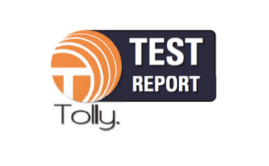

- 性能
- 3倍于友商

NetEngine AR6000全系列支持5G

- 视频
- 优化

可视运维&ZTP

SD-WAN

- 900Mbps(下行)/230Mbps(上行)*
- 双卡单待
- NSA/SA，5G/4G/3G

- 应用
- 选路

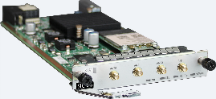

- 安全
- 组网

5G板卡

- ZTP&可视化运维，分钟级网络开通
- 视频优化：A-FEC，丢包20%不卡顿

*未开启5G上行测试速率

## Slide 10

5G上行

全系列NetEngine AR6000支持5G，为企业构建5G高速园区出口

全系列NetEngine AR6000支持5G，为不同规模企业分支构建5G高速网络出口

可插拔式5G 板卡

- NetEngine
- AR6121

- NetEngine
- AR6140

- NetEngine
- AR6280

- NetEngine
- AR6300

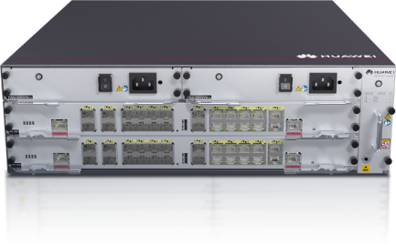

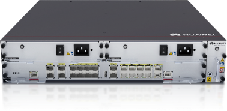

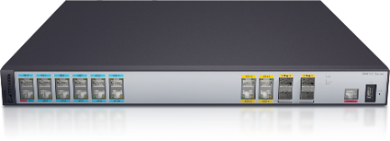

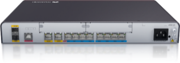

- 万兆上行&多业务
- 中小型分支

- 高性能多接口 & 双电源冗余
- 中型分支

- 3倍业界性能 & 双主控双电源
- 总部/大型分支

- 3倍业界性能 & 双电源冗余
- 总部/大型分支

### Speaker Notes

在我们新建的云数据中心的一个2000台节点的可用区中，我们采用华为的SDN解决方案，同等规模，如果按照传统模式部署，需要至少2周完成基础的网络配置和连通性验证，在AC控制器配合ZTP功能的帮助下, 实现了整体网络的零配置上线，以及overlay配置的自动下发，基础网络交付缩短至3天之内，业务配置的发放更是可以做到分钟级。极大减轻了资源交付阶段的压力，但是这样还不够，资源交付了，接下来面对的就是业务的上线和伸缩：那么问题来了：业务意图与最终的网络的配置之间往往存在巨大的鸿沟。

## Slide 11

5G上行

企业级NetEngine AR路由器：全系列NetEngine AR6000支持5G上行

- 企业级NetEngine AR 路由器
- 大带宽：
- 5G SA：230M UL，900M DL
- 5G NSA：115M UL，900M DL
- 全网通：5G/4G/3G全网通
- 双架构：完整支持NSA/SA

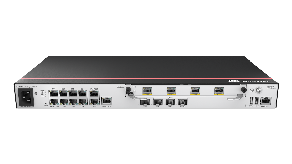

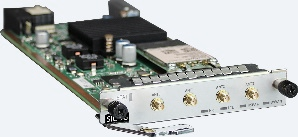

NetEngine AR

5G板卡

超宽上行

多链路互备，业务永续

单芯多模，平滑演进

UL

UL

230Mbps

50Mbps

5G 板卡

- 双卡单待
- 经久不掉线

SIM1

SIM2

900Mbps

300Mbps

DL

DL

VS

- 全网通
- 一步到位

3G / 4G / 5G

5G/有线

A-FEC

5G

5G

5G

- 多链路互备
- 多链路A-FEC，无感知切换

信号干扰

- 双模网络
- 平滑升级

NSA

SA

A-FEC

4G

5G

SIM2

X

SA架构场景实测数据，单向最大值，数据包>1400 byte

## Slide 12

5G上行

NetEngine AR：为千行百业提供百倍带宽，超低时延，即插即用的园区出口

5G+智慧银行

5G+办公园区

5G+智慧零售

5G+智慧医疗

5G上行，百倍带宽扩容

应用智能选路& A-FEC over 5G/Fiber

免布线，零接触开局

毫秒级时延保障远程医疗

流畅视频体验

TTM：1 天

- 网点自助服务
- 结售汇效率提升

30%↑

治疗效率提升

60%↑

新店快速扩张

20%丢包不卡顿

### Speaker Notes

- 1、基于5G AR，建行首推5G +智能银行。构建“5G+MSTP专线”双通道服务网络，借助5G实现网点带宽从20M扩容到 > 500Mbps（峰值速率>1Gbps）。
- 2、保障金融太空舱，智慧柜员机（>20M），摄像头（>20个，>100Mbps）等近100智能终端带宽需求，为仿真机器人，班克投影（<10ms）提供低延时体验。
- 3、不仅提升客户全旅程金融服务体验，同时分流人工柜台近2/3的客户，客户排队等待时间平均减少约5分钟，结售汇业务从10分钟缩短为0.67分钟，理财产品销售办理从5分钟缩短为1分钟，客户满意度大幅提升。

## Slide 13

3x业界性能

3倍业界性能：创新CPU+NP+硬件加速器异构转发架构

全业务智能时代需要高性能转发

创新异构转发，3x业界的转发性能

企业带宽需求指数级增长，性能需求 > 100Mbps

100Mbps~

match

∑

…

IoT/VR

1~10Mbps

match

4K/8K

CRM

CRM

Cloud/AI

ACL/FIB

~1Mbps

ERP

ERP

Email

Email

Email

全业务智能时代

办公互联时代

业务专线时代

- 独有硬件加速器
- SA, QoS, IPSec, 优化加速

多核CPU分流负荷

首次引入专业NP

选路

10.20.11.200

传统路由器开启 SD-WAN性能下降80%

HQoS

监控

10.20.11.220

10.30.11.210

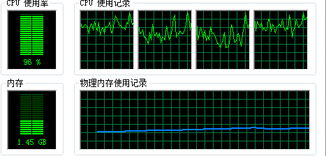

优化

传统WAN

识别

SD-WAN

- L3流量超快转发
- NP卸载L3流量，内置自研芯片加速算法，提升ACL，FIB等原子操作速度

- L4~L7业务处理
- 基于流量路由，QoS，VPN，安全等策略预计算分流保序，绑定多核并行处理，发挥多核优势

- 特定业务硬件加速
- 独立硬件逻辑模块，不占用CPU，单业务处理效率2倍

- L4~L7
- Application

10.20.22.200

安全

路由

SA加速器

10.20.22.220

- L3
- Package

VPN

10.30.22.210

QoS加速器

QoS

VPN

SEC加速器

性能需求：●●

性能需求：●●●●●

Optimization加速器

### Speaker Notes

架构，芯片，算法，

## Slide 14

3x业界性能

Tolly实测： NetEngine AR转发性能全面领先友商

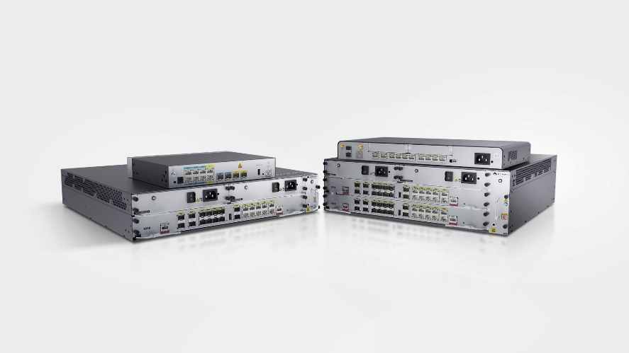

Tolly实测：全系列NetEngine AR，3大性能指标全面领先友商

- 实测数据超过华为彩页宣称值
- 无需购买License，实测数据领先友商三档License性能值

- 中立第三方
- 国际权威测评机构 · 美国

AR6121：在友商同档次设备叠加最高性能License前提下，3 大性能指标仍为友商同档次性能2~5倍

2x

4x

5x

带业务（Qos & ACL & NAT）性能

基础性能（ IMIX ）

IPSec性能（ IMIX ）

4G

2.32G

2.32G

650M

2G

456M

友商

友商

友商

华为 AR6121

华为 AR6121

华为 AR6121

### Speaker Notes

- 1、得益于内置华为自研Solar芯片，经国际权威的第三方测评机构Tolly的测试，华为全系列5G AR转发性能全面领先C。
- 2、以NetEngine AR6121为例，在C同档次设备叠加最高性能License的前提下，包括基础性能，IPSec性能，带业务性能的3 大性能指标仍为C同档次性能2~5倍，全面碾压C。

## Slide 15

品质体验

全流程自动化，即插即用

可视化运维

故障定位

小时

分钟

- 基于GIS地图的网络监控，应用/链路/站点/整网状态可视
- 网络自动巡检，精准告警信息邮件通知

可视化

GIS地图

45+报表

告警

巡检

全流程自动化

业务配置

全流程自动化

- 30
- 分钟

- 5
- 分钟

站点创建

链路打通

拓扑编排

选路策略

QoS调度

安全防护

- 模板化，流程化的站点和网络拓扑配置
- 应用为中心的选路，QoS和安全策略

即插即用

设备上线

多场景ZTP开局

邮件

注册中心

ZTP

分支

小时

分钟

丰富ZTP开局方式，设备即插即用

DHCP

USB

## Slide 16

品质体验

可视运维，45+视图，提升运维效率

快速定位故障设备或站点

优化WAN投资及配置策略

快速获取异常流量

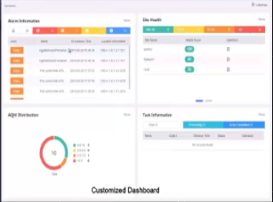

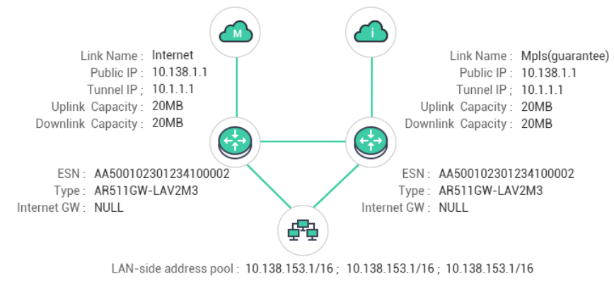

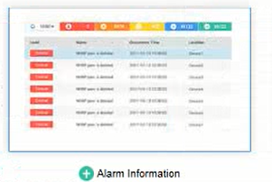

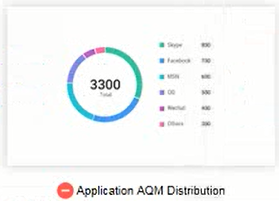

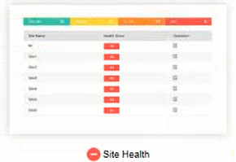

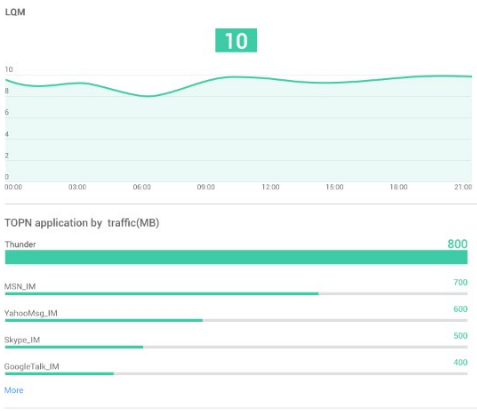

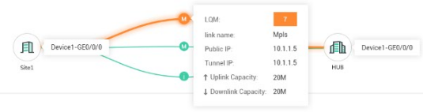

    - 45+自定义视图
    - 站点/链路/应用/设备/用户健康度视图

    - 拓扑状态可视
    - 基于站点、链路的拓扑展示
    - 企业实时获取站点、链路的状态及性能信息

    - 告警实时监控
    - 自定义Dashboard（角色或偏好）
    - 全网实时告警（分钟级）

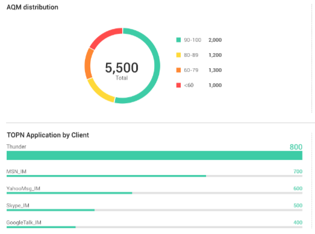

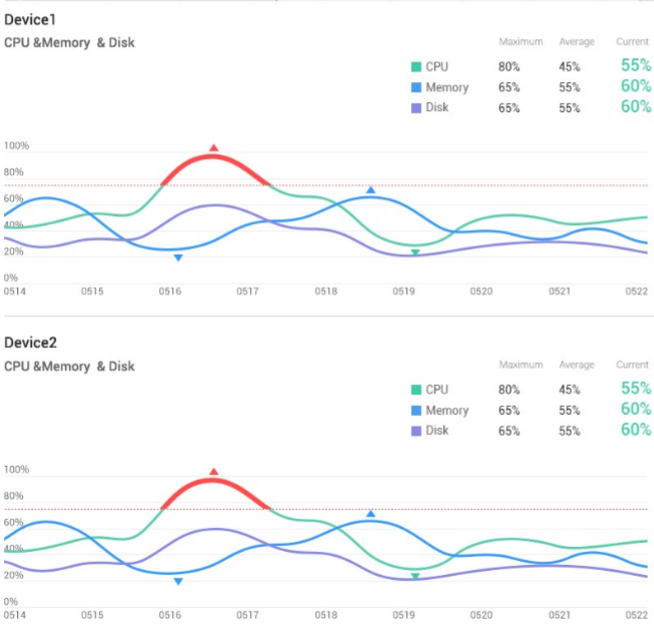

- 站点带宽利用率
- Top N 吞吐量站点

- Top N 应用流量
- 链路吞吐量趋势…

运维DEMO

## Slide 17

品质体验

应用级智能选路，关键应用体验可保障

客户价值

- ①3大识别技术
- 快速识别关键应用

- ②应用级智能选路，关键应用自动切换至最优链路
- 基于应用SLA，优先级，带宽多因子智能选路

- 可保障
- 的关键应用体验

首包识别

MPLS

特征识别

关键应用自动切换至最优链路

自定义应用

链路拥塞

- > 90%
- 带宽利用率

丢包/延时/抖动

Internet

充分利用MPLS，Internet，LTE等混合链路

最优链路

- 关键应用
- 如视频，ERP等

[EN](#slide-8)

### Speaker Notes

- AI是一种技术，华为云致力于将AI和企业实际业务场景深度结合，提供华为云EI（Enterprise Intelligence）服务和EI智能体解决方案，用AI技术解决企业实际业务问题。
- EI ModelArts是华为云提供的一站式普惠AI开发平台。通过“极快” （图像识别训练全球最快）和 “极简”（通过创新的ExeML自动学习技术）实现0代码AI模型开发
- 华为云提供EI Advanced API的丰富接口。这些接口有两个特点，全领域覆盖（支持全域的AI能力开发，即支持视频，图片，语言和文本等）；“零门槛”，企业应用的开发人员能很简单的使用这些API接口。
- 华为云除了面向开发者提供一站式普惠AI开发平台，和面向企业应用提供EI API服务外，结合行业Know how和企业生产运营的大数据，面向工业，交通，城市等行业场景提供EI 智能体解决方案。
- 华为云是目前国内唯一的提供AI全栈全场景能力的云服务商。
- 华为云EI ModelArts，从0到1开发训练AI模型，通过“极快”和“极简”实现普惠AI。华为云EI ModelArts一站式AI开发平台，提供海量数据预处理及半自动化标注、大规模分布式训练、自动化模型生成，以及端-边-云模型按需部署能力，管理全生命周期 AI 工作流。
- 图像识别训练全球最快（By 斯坦福大学 DAWN Benchmark测试）；通过创新的ExeML（自动学习）技术，，实现0代码极简AI模型开发。
- **********************************
- Slide Owner: Gaoshijie（00477859） Cloud BU MKT
- Latest update: Jan, 2019
- Recommended target audience: all
- **********************************

## Slide 18

- 企业互联迈入5G+SD-WAN时代
- 华为SD-WAN解决方案，打造企业上云宽管道
- 成功案例

## Slide 19

案例：中国建设银行积极推动5G+智慧银行转型

客户价值

5G上行，100x带宽，毫秒级时延

5G (UL: 230 Mbps; DL: 900 Mbps)

5G

5G

0.67分钟

1天

现在

DL：900M，UL：230M

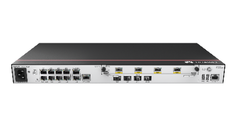

5G

5G

专线

过去

10分钟

专线

2M

30天

VTM， 太空舱

太空舱

机器人， IoT

STM智能柜员机

2M

金融云

仿真机器人

AI, 千人千面

1天通网：免布线，即插即用

结售汇业务

100Mbps

2Mbps

专线 (2 Mbps)

…

20M

20M

10M

2~10M

最优体验：SD-WAN使能应用级智能选路

班克互动

人工柜台

VS

- 传统网点
- 交易结算型

- 智慧网点
- 营销服务型

传统

- 结售汇办理
- 时间90%↓

华为

### Speaker Notes

- 1、基于5G AR，建行首推5G +智能银行。构建“5G+MSTP专线”双通道服务网络，借助5G实现网点带宽从20M扩容到 > 500Mbps（峰值速率>1Gbps）。
- 2、保障金融太空舱，智慧柜员机（>20M），摄像头（>20个，>100Mbps）等近100智能终端带宽需求，为仿真机器人，班克投影（<10ms）提供低延时体验。
- 3、不仅提升客户全旅程金融服务体验，同时分流人工柜台近2/3的客户，客户排队等待时间平均减少约5分钟，结售汇业务从10分钟缩短为0.67分钟，理财产品销售办理从5分钟缩短为1分钟，客户满意度大幅提升。

## Slide 20

平安科技: 优化AI客服体验，保险出单从2小时缩短到10分钟

SD-WAN助力平安科技上线AI客服

- 应用级智能选路保障AI客服体验
  - 低成本Internet（10~30M）扩容 MPLS专线（2~10M），承载AI客服业务，依托应用级智能选路保障AI客服体验
- 免进站网络部署
  - 人寿网点网络分钟级开通，设备即插即用，无需专业人员，免进站部署
- 全流程自动化管理
  - 基于整网、分支节点、用户、应用等多维度状态可视，简化运维，全流程自动化，减少外包服务人力

### Speaker Notes

- 客户：非盟
- 驱动力
- 信息安全要求,大量会议机密材料只能内部共享及电子阅览，不能打印成纸件
- 移动办公需求
- 重大会议期间，需要临时配备大量PC
- 运维管理工作繁重，效率低下
- 解决方案
- 为非盟国际会议中心提供桌面云解决方案，支撑非盟第18届峰会，在一个平台上实现办公、会议、在线视频会议等业务
- 客户价值
- 会议效率有效提升，桌面云系统得到非盟第18届峰会成员国与会人员的高度称赞
- 移动办公特性得到非盟副主席高度认可
- 非盟内部开始使用华为桌面云系统为其内部员工提供日常视频培训

## Slide 21

- 以澎湃动力
- 引领智能IP网络

Powered by

